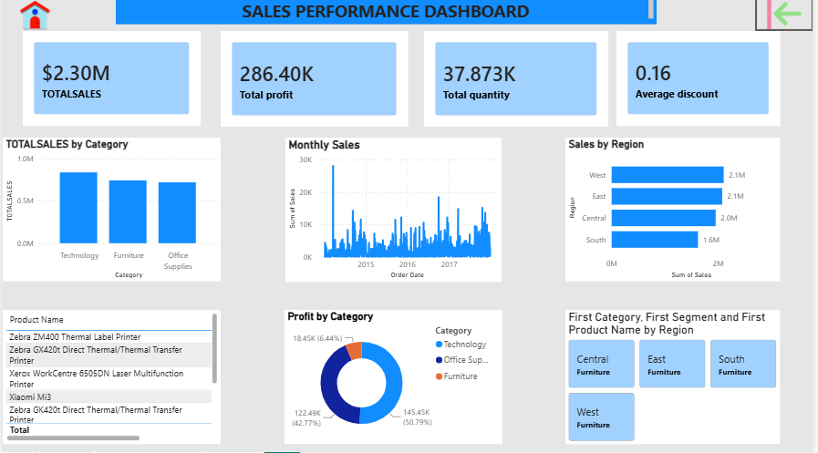

# 📊 Superstore Sales Dashboard

## 🌐 Live Dashboard

👉 **View the Interactive Power BI Dashboard:**  
https://app.powerbi.com/links/0GsmYBphon?ctid=f9a743c3-3b53-49b3-963f-b36207247baf&pbi_source=linkShare

---

## 🖼️ Dashboard Preview

---

## 📋 Project Overview

This interactive Power BI dashboard analyzes Superstore sales data to provide actionable insights into sales performance, profitability, customer behavior, and regional trends. It enables business users to monitor key performance indicators (KPIs) and make informed, data-driven decisions.

---

## 🎯 Business Objectives

- Analyze overall sales and profit performance.
- Identify top-performing product categories.
- Compare sales across regions.
- Monitor monthly sales trends.
- Discover customer purchasing patterns.

---

## 📈 Dashboard Features

- 📌 Sales KPI Cards
- 📌 Profit KPI Cards
- 📌 Sales by Category
- 📌 Profit by Category
- 📌 Regional Performance Analysis
- 📌 Monthly Sales Trend
- 📌 Customer Insights
- 📌 Interactive Filters & Slicers

---

## 🛠️ Tools & Technologies

- Microsoft Power BI
- DAX
- Power Query
- Microsoft Excel

---

## 📂 Repository Contents

- Superstore.pbix
- Superstore-Dashboard.png
- README.md

---

## 👤 Author

**Elijah Chika**

**Data Analyst | Power BI | SQL | Excel | Python | Tableau**

🌐 **Portfolio Website**  
https://sites.google.com/view/chikas-data-analytics/home

💻 **GitHub**  
https://github.com/Elijahchika

📊 **Live Power BI Dashboard**  
https://app.powerbi.com/links/0GsmYBphon?ctid=f9a743c3-3b53-49b3-963f-b36207247baf&pbi_source=linkShare

---

⭐ *If you found this project helpful, please consider giving this repository a star!*
